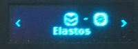
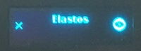

# Elastos Ledger Nano S Guide

## Introduction

Elastos, Welcome to The Modern Internet!

## Requirements

To use Elastos with a Ledger Nano S Device, you need a Ledger Nano S Device, and need access to the internet.

We recommend using the Elastos Light Wallet:
[Elastos Light Wallet](https://github.com/coranos/elastos-light-wallet/releases)

## Installation and Setup Instructions

Initial setup:

If you haven’t already, create a PIN for your Ledger and install Ledger Live Desktop from http://ledger.com or https://github.com/LedgerHQ/ledger-live-desktop/releases.
Don’t forget to back up your recovery phrase!

### Connect your Ledger device to your computer via USB and unlock it with your PIN.
Open Ledger Live Desktop, select “Manager” in the left panel, and install the Elastos application.

### On your Ledger device, select the newly installed Elastos application.

You should now see a home screen that looks like this:

## Connect your Ledger to Elastos Light Wallet.

### With your Ledger connected to your computer, open the Elastos Light Wallet.

If your Ledger is properly connected to your computer with the Elastos application installed and open, you will see “Ledger Ready” on the main screen of the light wallet.

### Click the 'use ledger' button.

After sending ELA from the light wallet you should now receive a notification on your Ledger prompting you to confirm or deny the transaction.

## View Account Balance
### To view the account balance, click on "Send" on the left side, and the account balance will be displayed.  

## Receive Crypto
### To receive crypto, look on the device for the receiving address.

## Send Crypto
### To send crypto, click on "Send" on the left side, specify the "to" account, and the "amount" and click "send".  

Be sure to verify the the transaction details on the device!

## Support
If you have trouble, the best way to get help is to contact coranos2 on reddit.
[Coranos2 on Reddit](https://www.reddit.com/user/coranos2)

## How It was made
This guide was made according to the ledger third party application design guidelines.

### Ledger Third Party Application Design Guidelines
[Ledger Third Party Application Design Guidelines](https://ledger.readthedocs.io/en/latest/additional/publishing_an_app.html#design-guidelines)
